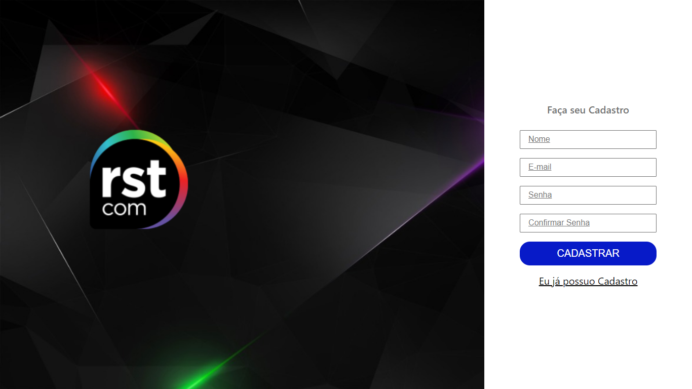
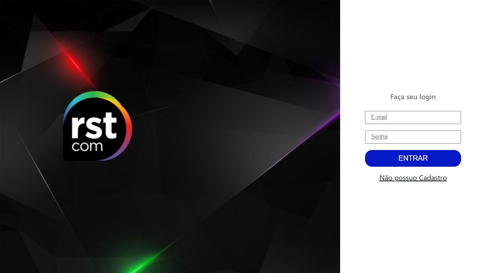
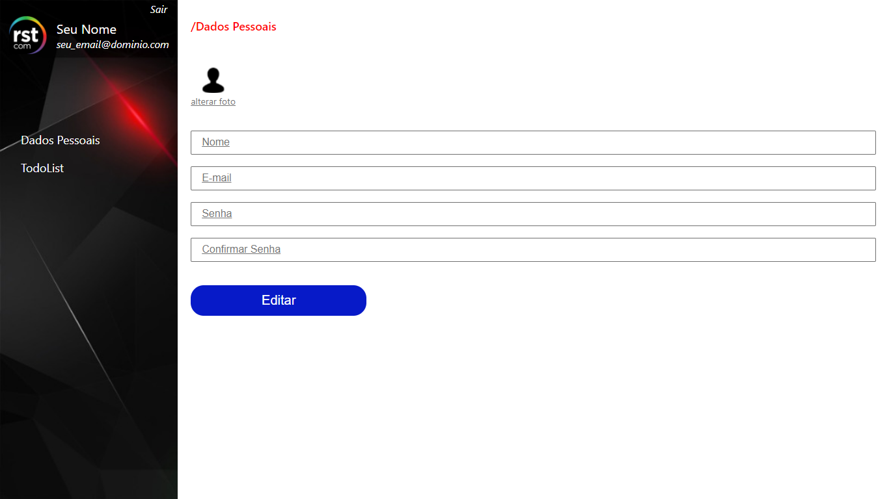
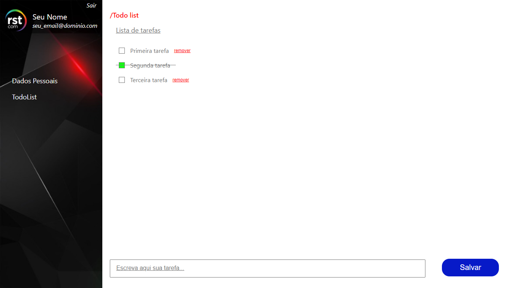

# RSTCOM Frontend Test

Projeto desenvolvido como teste para a vaga de Desenvolvedor Frontend na RSTCOM.

O projeto foi feito com base em um layout disponibilizado apresentando 4 telas com Login, Cadastro, Dados do usuário para edição e Lista de tarefas.

Nas páginas de login e cadastro implementei apenas um validação simples dos dados, já que não haviam especificações desses detalhes para o teste. Basta preencher os campos corretamente para avançar, não implementei sistema de autenticação neste teste.

O deploy do projeto foi feito na Netlify e pode ser acessado [neste link](https://rstcom-frontend-test.netlify.app/)

## Tecnologias :computer: :hammer_and_wrench:

- ReactJS
- Next.js
- Typescript
- styled-components

## Screenshoots :camera:

